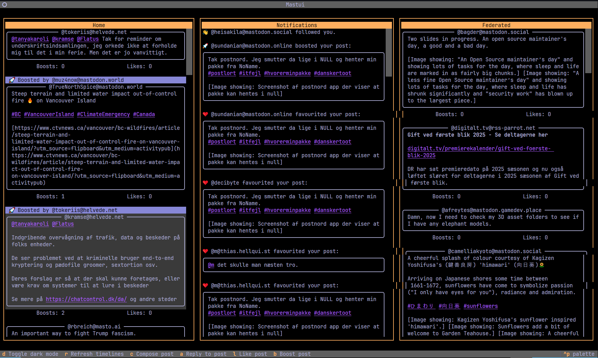

# Mastui - A Mastodon TUI Client Built with Python

Mastui is a Mastodon TUI client built with Python and Textual. It allows users to interact with their Mastodon instance in a terminal environment, providing a more efficient and intuitive way of managing their Mastodon experience. The UI is multi-column to get an easy overview of activities.

## Features

* User Profile Management
* Timeline Viewing
* Post Creation
* Reply Creation
* Like/Unlike
* Direct Messaging
* Local Mastodon Server Support
* Theming and Customization (via textual themes)
* Content warning support (currently always shown)

### TODO

* Profile viewing
* View threads
* database backend
* Bookmarking
* Follow/Unfollow
* Hashtag Searching

## Installation

To install Mastui, follow these steps:

1. Clone the repository to your local machine using `git clone https://github.com/kimusan/mastui`
2. Install the dependencies listed in pyproject.toml using `poetry install`
3. Create a new configuration file by copying the config-example.py file and renaming it to config.py, then fill in your Mastodon instance URL, and follow the onboarding steps described.
4. Run the application using `poetry run mastui`

## Technology Stack

* Python 3.x
* Poetry for dependency management and packaging
* Textual for TUI creation and management
* Requests for HTTP requests to Mastodon instances
* BeautifulSoup for HTML parsing
* Pygments for syntax highlighting
* Pytest for testing

## Dependencies

The following dependencies are required to run Mastui:

* Poetry
* Python 3.x
* Requests
* BeautifulSoup4
* Pygments
* Textual

## License

Mastui is licensed under the MIT license. See LICENSE for more information.

## Contributing

Please read CONTRIBUTING.md for details on our code of conduct, and the process for submitting pull requests to us.

## Versioning

We use SemVer for versioning. For the versions available, see the tags on this repository.

## Authors

* **Kim Schulz** - *Initial work* - [kimusan](https://github.com/kimusan)

See also the list of contributors who participated in this project.

## Acknowledgments

* Inspiration and guidance from the Textual community and the Poetry team
* The Mastodon community for their contributions to the development of the application and its features
* Other projects that have inspired or influenced the design of Mastui

Please feel free to reach out to me if you have any questions, comments, or concerns.
